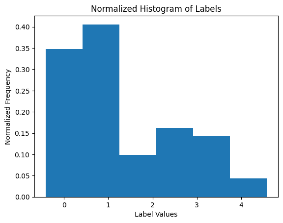

# Introduction

The following project utilizes the Emotion Dataset to study different approaches for the Emotion detection task. 

The emotion detection task is an NLP task. The inputs are in text form and the labels correspond to various emotions. In the case of the dataset used, the emotions are "sadness", "joy", "love", "anger", "fear", "surprise". The goal is to develop a model that 

# Research Goals
The goals of this project are as follows

1. To investigate a good tokenization strategy for the Emotion Detection Task.
2. To investigate a good model for the Emotion Detection Task. A good model is one with high accuracy and F1-score.
3. To analyze the structure of the emotion dataset through unsupervised learning methods.

# Methods
The following section outlines the approaches taken for investigating the dataset 

## Exploratory Data Analysis
The dataset consists of 20,000 entries with two features. 
* text - a string corresponding to a tweet that has been preprocessed to be in lower case, with no hashtags, mentions or URL links. 
* label - a number corresponding to the emotion shown in the text. The distribution of the emotions for the whole dataset are shown in the image below. Notably, the label distribution is highly skewed. 

The dataset was obtained from Kaggle. It has already been divided into training, testing, and validation sets with an 80-10-10 split. The split was verifed to have preserved the label distribution across each dataset (i.e., the samples were distributed evenly)

## Feature Extraction
As part of the preprocessing stage, the group performed three kinds of data manipulation to extract more features. Each produced a new dataset

1. Tokenization - this involves a character level tokenization scheme. This was chosen because the dataset is of small size and conventional tokenization algorithms such as Byte Pair Encoding would simply give an overparameterization of the dataset. 

2. BERT - this involves using the final, non-padding hidden layer output produced by running the text through BERT. Note that for the sake of time and compute, PCA was ran on the BERT embedding to obtain 100 components. This is in contrast to the approximately 30 000 features. 

3. LaBSE - this involves using the sentence level embeddings produced by LaBSE- which is a multilingual, sentence-level encoder. This produced 768 features. 

In the notebook, we have the folders, CHAR, BERT, and LABSE. These indicate which dataset has been used.

## Data Preprocessing
We make use of data preprocessing techniques in addition to the Machine Learning models formulated.

These techniques include the following.

1. Principal Component Analysis - this is applicable for LaBSE in particular. PCA was ran on the dataset using only the design matrix derived from the training data as input. The transform associated with this PCA is then used for the validation and test sets whenever needed. 

2. Forward Feature Selection - this makes use of a sequential feature selection algorithm to incrimentally select the best features to include in the dataset. This approach was applied only for the LABSE datasets since PCA already acts as a feature selection algorithm.

Runs which do not make use of either method were also performed for LaBSE in particular to test if these methods help improve the model's performance. 

## Hyperparameter Optimization
Each model makes use of hyperparameters. In order to tune these hyperparameters, the group makes use of Grid Search. Grid Search makes use of all possible combinations of hyperparameters and runs k-folds cross validation to find the best set of hyperparameters.  In all notebooks, k=5.

# Supervised Models 
The following models were used on the BERT and LABSE datasets. 

1. Decision Trees 
2. KNN
3. SVM
4. MLP

The following methods were used on the CHAR dataset. Note that because the data in this dataset are sequential, we can immediately rule out the use of Decision Trees, KNNs and SVMs as these do not take into account the structure of the dataset. 

1. MLP 
2. LSTM
3. Encoder-Based Transformer .

The Neural Network based models are trained with Early stopping in mind. This is a method which halts training whenever a certain difference between validation and training loss is met. This prevents overfitting of the model, and is motivated by the insight that -- beyond a certain point of training, a neural network will have already overfitted rather than generalized.

For all Neural Network models (MLP, LSTM, Encoder-Based Transformer), we make use of a Dropout Strategy. Dropout makes the neurons more robust by introducing random noise into the dataset (i.e., by droppoing out certain neurons during training). 

Training for the neural networks was conducted ussing the Adam Optimizer operating under Cross Entropy Loss. 

## Results Summary
Results indicate that the dataset produced using LABSE is the most promising, with a Single Layer Perceptron achieving 60% accuracy in only 200 epochs. 

Models using the raw CHAR dataset were only able to achieve around 30% accuracy at best. 

Models using the BERT dataset were able to perform better with around 48% accuracy. However, this does not compare to the high performance in the LABSE-trained models. This is possibly due to the fact that LABSE was specifically designed for sentence embeddings, which capture the semantics of a sentence better than BERT's embeddings, which were trained on a causal and masked language modeling tasks. These tasks are more suited for text generation and cloze-test style tests. 

# Unsupervised Learning 
In order to analyze the structure of the dataset, the group performed k-means clustering. Clustering was done on the LABSE dataset since the tests from supervised learning indicated that it was the dataset that was able to capture the emotion better.

PCA was ran on the dataset. The number of components was chosen using hyperparameter optimization. Another hyperparameter that was considered was the value of k for k-means clustering.

Hyperparameter optimization was done by determining the V measure of the clustering model. The V measure is analogous to the F1-score for unsupervised learning tasks. It is the harmonic mean of the homogeneity and completeness of the given clustering. A higher V measure indicates a better model.

In addition to k-means clustering, Self-Organizing MAPS were used to visualize the dataset by projecting it onto a 2D plane. The visualization was produced by displaying the majority class of each neuron in the model. Another visualization was also prepared to show the distance maps of each of the labels. 

